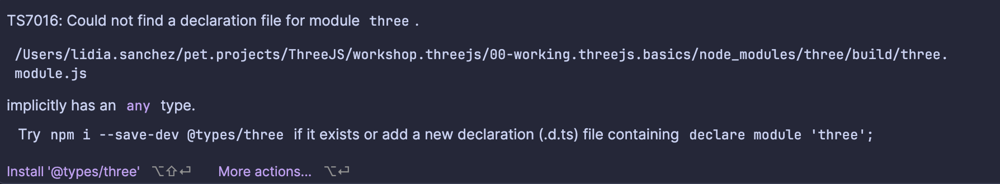
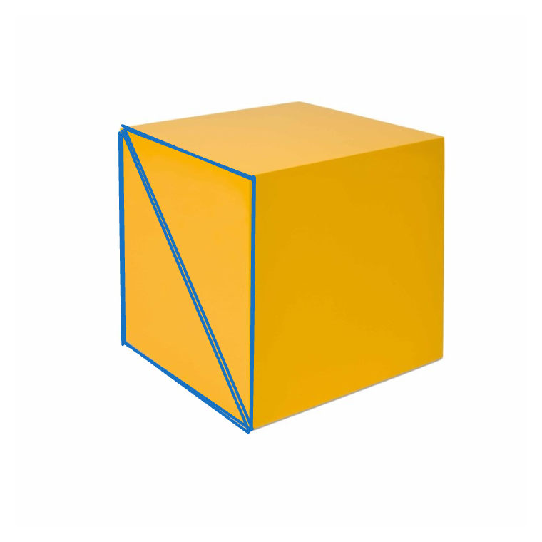
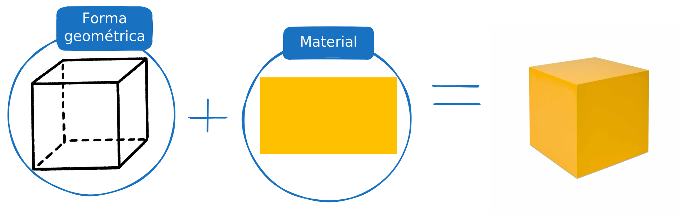
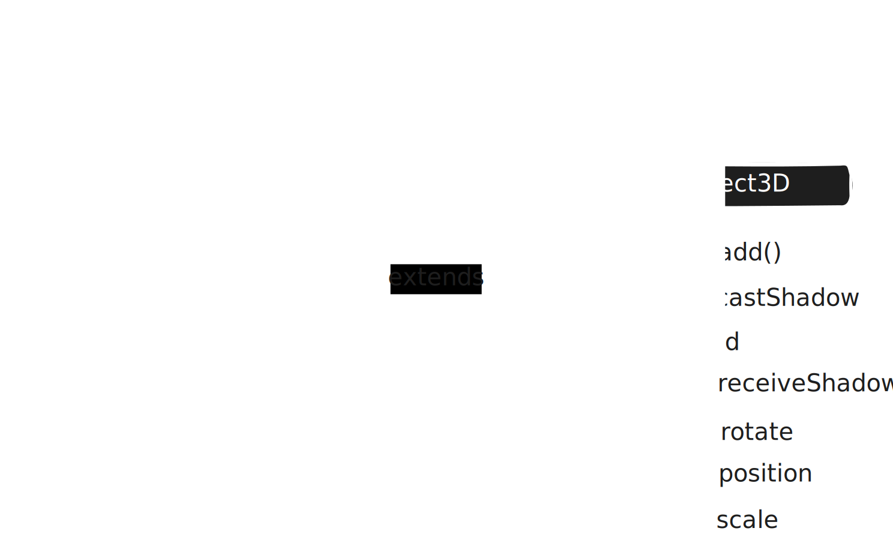
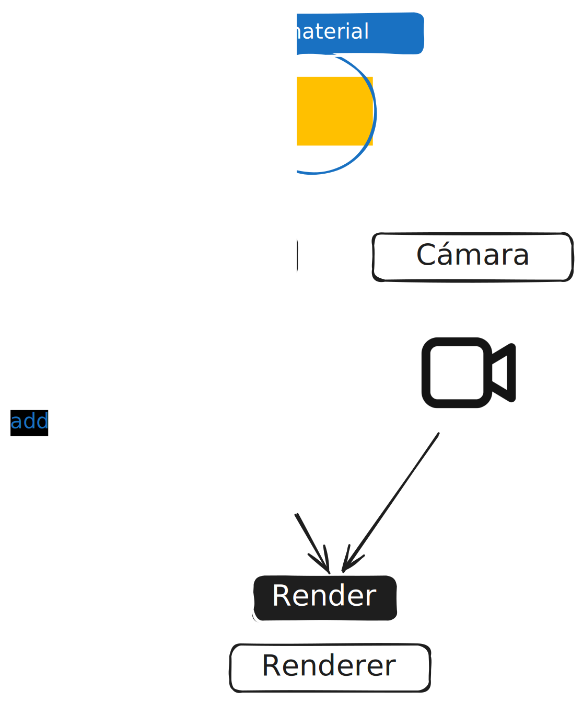
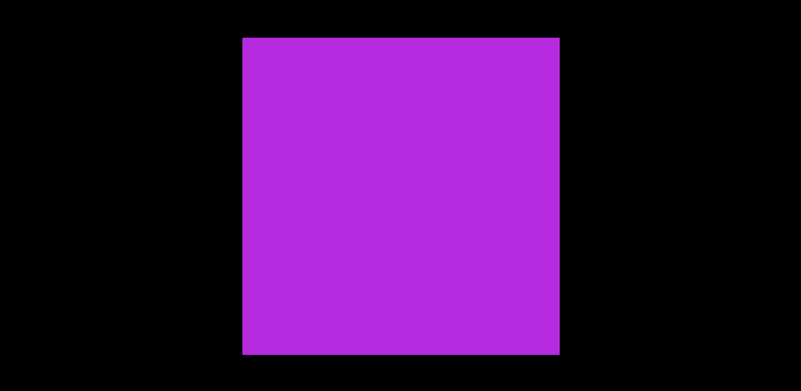

# 00. Escenario básico

## Comenzando por el principio

Vamos a crear una escena **básica** de ThreeJS. Crearemos una caja, material básico y una cámara con la que visualizarla.
Lo primero de todo es instalar ThreeJS en nuestro proyecto.

La instrucción que debemos usar es ``npm install --save three``

> https://threejs.org/docs/#manual/en/introduction/Installation

> Nota: Como estamos usando Typescript, podemos instalar **los tipos** de ThreeJS (de hecho, lo que hará será
> "quejarse" y pedirnos que los instalemos)
> 

## Creando el primer escenario

El primer escenario funcionará como una **primera toma de contacto** con ThreeJS. Nos servirá para aprender los
primeros pasos y comprender un poco cómo funciona esta librería.

> https://threejs.org/docs/#manual/en/introduction/Creating-a-scene

En lugar de seguir el tutorial de ThreeJS, vamos a hacer **nuestro propio tutorial**.

### Creando una caja geométrica

Primero, vamos a crear nuestra **primera caja**.

```
const BOX_WIDTH = 5;
const BOX_HEIGHT = 5;
const BOX_DEPTH = 5;

function createFirstBox(){
    const boxGeometry = new THREE.BoxGeometry(BOX_WIDTH,BOX_HEIGHT,BOX_DEPTH);
    const boxBasicMaterial = new THREE.MeshBasicMaterial({
        color: 0xC710E8
    });

    return new THREE.Mesh(boxGeometry, boxBasicMaterial);
}
```

> También puedes seguir las instrucciones de la página oficial https://threejs.org/docs/?q=BoxGeom#api/en/geometries/BoxGeometry


De este código podemos extraer lo siguiente:
1. Se está creando una instancia de ``BoxGeometry`` que tiene 5 de **ancho**, 5 de **alto** y 5 de **profundo**.

> Pero ¿5 de qué? ThreeJS no determina _qué tipo de medida_ se utiliza para crear una caja. Ese 5 supone _una unidad en el espacio_. Somos nosotros,
> como desarrolladores, los que decidimos _qué representa_ ese 5: si representa metros, centímetros... Podríamos, incluso,
> decidir que 5 equivale a 10 metros, por ejemplo. Para este ejemplo, asumiremos que 1 es 1metro, por lo que 5 son 5metros.

Fijémonos en el constructor de ``BoxGeometry``:

````
BoxGeometry(width : Float, height : Float, depth : Float, widthSegments : Integer, heightSegments : Integer, depthSegments : Integer)
````

_Puede_ recibir 6 parámetros, **todos ellos opcionales**, y todos ellos tienen un valor por defecto.

> De hecho, ``new THREE.BoxGeometry( 1, 1, 1 )`` es lo mismo que ``new THREE.BoxGeometry()``

### Creando el material de la caja

La siguiente instrucción es crear un **material**.

> ¿Qué es un material?
> Un material es una **característica** que define _cómo se ve_ una figura geométrica: el color, su dureza, su rugosidad, y otras características.

De momento solo vamos a definir **su color**:

```
const boxBasicMaterial = new THREE.MeshBasicMaterial({
        color: 0xC710E8
    }); 
```

> Nota: es importante que los colores tengan el sufijo **0x**


### Creando la forma

Y a continuación definimos su **forma**:

```
    return new THREE.Mesh(boxGeometry, boxBasicMaterial);
```

> https://threejs.org/docs/#api/en/objects/Mesh

Si leemos la documentación oficial, dice:

``Class representing triangular polygon mesh based objects.``

Y es que las formas están basadas en **triángulos**. 



Por tanto, realmente (por detrás) se están creando _triángulos por cada cara del cubo_.
El constructor de la clase ``Mesh`` admite dos parámetros:

``Mesh( geometry : BufferGeometry, material : Material )``

Todos los métodos que se llaman XGeometry (``BoxGeometry``, ``SphereGeometry``) heredan de la clase ``BufferGeometry``, y cuando creamos una caja con
``new THREE.BoxGeometry()`` ocurre algo así por detrás:

````
const vertices = new Float32Array( [
	-1.0, -1.0,  1.0, // v0
	 1.0, -1.0,  1.0, // v1
	 1.0,  1.0,  1.0, // v2

	 1.0,  1.0,  1.0, // v3
	-1.0,  1.0,  1.0, // v4
	-1.0, -1.0,  1.0  // v5
] );
````
De momento no vamos a ahondar en esto, pero es importante saber que todas las geometrías heredan y provienen de ```BufferGeometry```.


#### Resumen de lo hecho hasta ahora:

- Hemos creado una caja con el constructor de ``BoxGeometry`` que tiene 1metro de ancho (definido así por nosotros), 1metro de alto y 1metro de profundidad.
- Hemos creado el material básico para esa ```BoxGeometry```, que tendrá un color entre rosa y morado.
- Hemos creado la ```forma```, que se define a partir de una geometría (``BufferGeometry``) y de un material.



### Creando la escena

Ya tenemos la caja; ahora, es necesario crear la **escena** donde residirá esa caja.

```
function createSceneAndAddBoxToIt(box: Mesh){
    const scene = new THREE.Scene();
    scene.add(box);
    return scene;
}
```

Para añadir la geometría a la escena, solo necesitamos hacer:

```scene.add(box)```.

```Scene``` es una clase que **hereda** de ``Object3D``

> Si miramos en la parte superior de la página, vemos que aparece "Object3D ->", y es quien nos indica que 
> la clase ``Scene`` hereda de ``Object3D``:
> https://threejs.org/docs/index.html?q=Scene#api/en/scenes/Scene

Y el método ``add`` realmente lo adquiere gracias a que es un ``Object3D``:
> https://threejs.org/docs/index.html?q=Scene#api/en/core/Object3D.add

El parámetro admitido es un objeto de tipo ```Object3D```, y esto nos permite deducir lo siguiente:
que la clase ``Mesh`` hereda de ``Object3D``.



### Creando el render

````
function setup(){
    const box = createFirstBox();
    const scene = createSceneAndAddBoxToIt(box);
}
````

Esta es nuestra función ``setup``, donde estamos haciendo todo el proceso. Hasta ahora hemos creado
una caja (de tipo ``Mesh``) y una escena, y hemos añadido esa caja a la escena. A continuación, debemos
invocar al ``render``, el encargado de _pintar_ toda la escena en el lienzo (en el ``canvas``).

````
function setup(){
    ...
    
    const renderer = new THREE.WebGLRenderer({ canvas: document.querySelector('#webgl')});
    renderer.render(scene);
}
````

Pero se va a quejar el método ``render`` porque requiere de **dos parámetros**, un ``Objeto3D`` (la escena) y **una cámara** (la cual aún no hemos creado).

### Creando la cámara

> https://threejs.org/docs/index.html?q=Camera#api/en/cameras/Camera

A diferencia de como ocurre al crear la escena, para crear una cámara no es tan simple como poner la siguiente instrucción:

```const camera = new THREE.Camera()```

Debido a que la clase ```Camera``` es una **clase abstracta**. Debemos decidir primero **qué tipo de cámara queremos**. Dado que estamos
haciendo una escena básica, no nos preocuparemos por el tipo (de momento), y crearemos una cámara de tipo **perspectiva**:

````
function createPerspectiveCamera(){
    return new THREE.PerspectiveCamera();
}
````

> https://threejs.org/docs/index.html?q=Camera#api/en/cameras/PerspectiveCamera


````
PerspectiveCamera( fov : Number, aspect : Number, near : Number, far : Number )
fov — Camera frustum vertical field of view.
aspect — Camera frustum aspect ratio.
near — Camera frustum near plane.
far — Camera frustum far plane.
````

Los parámetros que recibe la clase ```PerspectiveCamera``` son:
1. El FOV (field of view): Básicamente define _el area visible en la pantalla para una cámara_. Cuanto más **amplio** sea el valor del fov, **mayor campo de visión** habrá (y viceversa).
2. El aspect ratio: Es la relación altura / ancho de una imagen. Las medidas son, por ejemplo, 4:3, 16:9, etc.
3. Near: Sirve para controlar _qué objetos están lo suficientemente cerca de la cámara_ como para que sean renderizados.
4. Far: Lo mismo que near pero aplicado a la distancia. Todo lo que supere en distancia al tope definido como _far_, **no** se renderizará.

Tiene valores predeterminados, pero usaremos estos:

```
function createPerspectiveCamera(){
    return new THREE.PerspectiveCamera(45, window.innerWidth / window.innerHeight, 1, 1000);
}
```

Ahora, el último paso, es añadir la cámara al método ```render```.

````
function setup(){
    const box = createFirstBox();
    const scene = createSceneAndAddBoxToIt(box);
    const perspectiveCamera = createPerspectiveCamera();

    const renderer = new THREE.WebGLRenderer({ canvas: document.querySelector('#webgl')});
    renderer.render(scene, perspectiveCamera);
}
````

### Resumen de lo hecho hasta ahora:

- Hemos creado nuestra primera forma: un **cubo**.
- Hemos creado la **escena** y **añadido** el cubo a ella.
- Hemos creado el renderizador y al método render hemos añadido la escena previamente creada.
- Hemos creado una _perspective camera_ que hemos añadido después al renderizador.

;

Y el resultado que obtendremos será algo así:


## ¿Renderizando?

Este rectángulo negro **no muestra nada de lo que esperábamos**. Antes, tenemos que solucionar varias cosas:

### Definiendo el tamaño del render

Tenemos varias maneras de definir el tamaño de ese rectángulo negro; o, dicho con mayor propiedad, del lienzo de renderizado.

1. Dar un tamaño a la etiqueta HTMLCanvas:

```<canvas id="webgl" width="500" height="500"></canvas>```

2. (La que más me gusta) Definir un tamaño en el render:

``renderer.setSize(window.innerWidth, window.innerHeight);``

Usaremos la segunda opción para que ocupe **todo el ancho y alto de la pantalla**.
Pero **seguimos sin ver** nuestra escena, ¿por qué? Porque cuando creamos los objetos, éstos se sitúan **por defecto** en la posición (0,0,0) de la escena
(eje x: 0, eje y: 0, eje z: 0). Entonces, la cámara se encuentra en la misma posición (0,0,0) que el resto de los objetos, por lo que **no los ve**. Si desplazamos 
la cámara en el eje z...

```perspectiveCamera.position.z = 10```

>   El código se vería así
> 
>```typescript 
> function setup(){
>    const box = createFirstBox();
>    const scene = createSceneAndAddBoxToIt(box);
>    const perspectiveCamera = createPerspectiveCamera();
>    perspectiveCamera.position.z = 10;
>
>    const renderer = new THREE.WebGLRenderer({ canvas: document.querySelector('#webgl')!});
>    renderer.setSize(window.innerWidth, window.innerHeight);
>    renderer.render(scene, perspectiveCamera);
> }
>
>```
>

Y ahora obtendremos un resultado como este:

.

