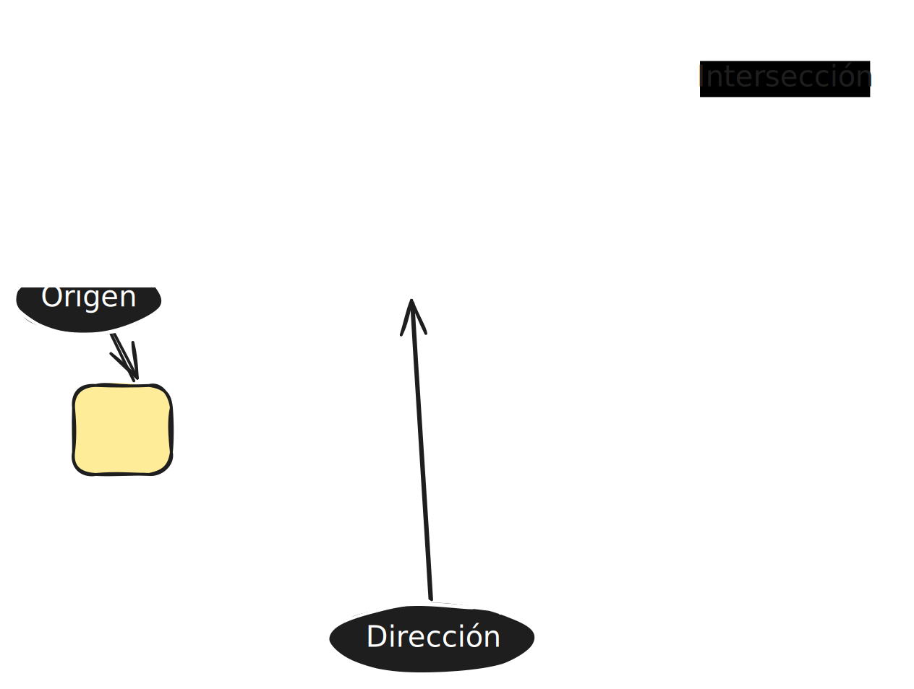

# 02. Raycaster básico

### ¿Qué es raycasting?

Raycasting es una técnica que sirve para detectar _cuándo un objeto está interseccionando
con otro_.

> Nota: No es lo mismo _interseccionar_ que _colisionar_. ThreeJS no tiene físicas de manera nativa,
> por lo que los objetos **no colisionan**, sino que se **interseccionan** entre ellos.

Un constructor raycaster recibe los siguientes parámetros:

> https://threejs.org/docs/#api/en/core/Raycaster

```
    constructor(origin?: Vector3, direction?: Vector3, near?: number, far?: number);

```

- Como primer parámetro el **origen**; es decir, el punto desde el que "nace" el raycaster.
- Como segundo parámetro, la **dirección**. ¿Hacia adónde apunta?

> Del tercer y cuarto parámetro no indaguemos, de momento.



> Puedes volver a definir la dirección + el origen mediante la función
> ```set(origin: Vector3, direction: Vector3): void;```

### Utilidad

Como dijimos anteriormente, sirve para detectar las **intersecciones** entre objetos:

#### intersectObjects

````
const intersections = raycaster.intersectObjects(scene.children, true);
````

``intersectObjects`` es una función que te permite **recorrer una serie de objetos 3D**, y puedes elegir si hacerlo de manera
**recursiva** o no (el segundo parámetro):

```
    intersectObjects<TIntersected extends Object3D>(
        objects: Object3D[],
        recursive?: boolean,
        optionalTarget?: Array<Intersection<TIntersected>>,
    ): Array<Intersection<TIntersected>>;
```

Lo que hace esta función es devolverte **todos los objetos que son atravesados por el rayo del raycasting**:

````
intersections.forEach( item => {
        (item.object as THREE.Mesh).material = new THREE.MeshBasicMaterial({
            color: 0xE81010 // si intersecciona, lo pintamos de rojo
        })
    })
````

Podemos hacer **acciones** en caso de que, efectivamente, el raycaster interseccione
con nuestro objeto deseado.
