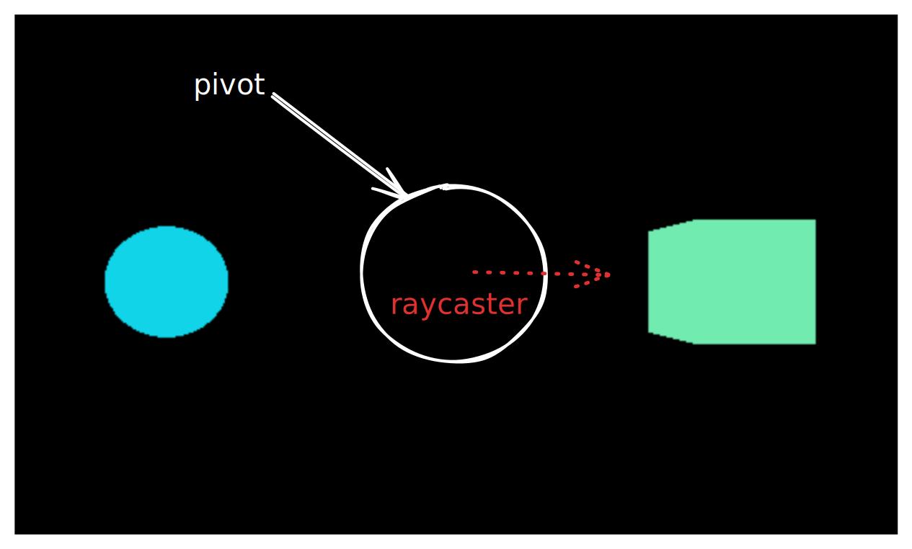

# 02.1 Raycast básico

## Estableciendo el escenario

Imaginemos el siguiente escenario:

Tenemos dos objetos en escena. Uno de ellos, es una esfera con las
siguientes propiedades:

```
const sphereGeometry = new THREE.SphereGeometry(1);
const sphereMaterial = new THREE.MeshBasicMaterial({
    color: 0x10D4E8
});
const sphereMesh = new THREE.Mesh(sphereGeometry, sphereMaterial);
sphereMesh.position.set(0,0,5)
```

El siguiente, un cubo:

```
const cubeGeometry = new THREE.BoxGeometry(2,2,2);
const cubeMaterial = new THREE.MeshBasicMaterial({
    color: 0x71EBAE
});
const cubeMesh = new THREE.Mesh(cubeGeometry, cubeMaterial);
cubeMesh.position.x = 5;
cubeMesh.name = 'testaferro'
```

Al cubo hemos decidido ponerle un nombre, **testaferro**.

> Los objetos en ThreeJS pueden tener una **propiedad** llamada **name**, que nos permitirá
> identificarlos. Esto será muy útil cuando trabajemos con modelos.


## El objetivo

Lo que queremos es que la esfera **gire** en torno al cubo, y que, cuando "colisione" con el cubo testaferro, éste se ilumine
**mientras dura la colisión** de otro color.
Para ello, tenemos que tomar una **perspectiva ligeramente diferente a la que pensaríamos normalmente**.

Una opción sería, por ejemplo:

- La esfera tomaría como referencia la **posición del cubo** para desplazarse en **círculos** a su alrededor.
- El cubo **testaferro** detectaría la colisión de la esfera con él.
- Cambiaría su color cuando lo detectara.

Sin embargo, aquí es donde **cambia** la manera de afrontar este problema.

- Ya sabemos que los objetos en ThreeJS **no pueden detectar colisiones**. Para ello, debemos apoyarnos por el **raycaster**.
- La esfera **no girará en torno al cubo testaferro**, sino que tendrá un elemento en pantalla que la **ayudará a girar**, dando el efecto
visual de ser **ella quien gire en torno al cubo**.
- Esto derivará en que tendremos **tres objetos** en pantalla, siendo el objeto de ayuda (al que llamaremos **pivot**) **invisible**.

## Creando el raycaster

Primero de todo, creemos los elementos faltantes de la escena: **la cámara**, la **escena** y el **render**:

Ahora, añadimos **solamente** el cubo a la escena.

```
scene.add(cubeMesh);
```

Y, a continuación, crearemos **el objeto que hará girar nuestra esfera**

> Cuando los objetos son **hijos** de otros objetos, **heredan** su posición, su tamaño, entre otras propiedades.
> Y cuando un objeto padre **rota** o hace cualquier otra transformación, **afecta directamente al hijo**.

Crearemos el objeto **pivot**:

````
const pivotGeometry = new THREE.BoxGeometry(cubeGeometry.parameters.width, cubeGeometry.parameters.height, cubeGeometry.parameters.depth);
const pivotMaterial = new THREE.MeshBasicMaterial({
    transparent: true,
    opacity: 0,
})
const pivotMesh = new THREE.Mesh(pivotGeometry, pivotMaterial);

````

> Nota: es importante que añadimos las propiedades transparent y opacity a true y 0 respectivamente, para que el objeto no sea visible en escena.

A continuación, añadimos el objeto **pivot** a escena.

```
scene.add(pivotMesh);

```

Y le decimos a nuestro objeto ``pivotMesh`` que añada la esfera:

```
pivotMesh.add(sphereMesh);

```

Y de momento, nuestra escena se ve así:

.

Como vemos, hay un rayo **raycaster** naciendo del cubo invisible central, de **pivot**. Aún no hemos creado
el raycaster, así que de momento ignorémoslo, pero quedémonos con esa idea.

Ahora que tenemos los 3 elementos en pantalla, vamos a hacer que la esfera **rote**.

## Rotando la esfera

Como dijimos antes, **un objeto3D padre puede afectar al posicionamiento de un objeto3D hijo**. Por tanto,
la idea es **rotar el padre para que el hijo se vea obligado a rotar**.

```
pivotMesh.rotation.set(0,Math.PI / -2,0)
```


> **Explicación sacada de la IA**

> Las rotaciones en matemáticas (y, por ende, en Three.js) 
> suelen medirse en radianes, no en grados. 
> La relación entre ambas unidades es que 180 grados equivalen a π radianes.
> Math.PI / 2 es igual a π/2 radianes, 
> que es lo mismo que 90 grados. 
> Y Math.PI / -2 son -π/2 radianes, equivalentes a -90 grados.

Si observamos la escena, veremos que ahora **la esfera está rotando**.

> Para que la esfera **rote en círculos**, debe encontrarse **en el eje sobre el que gira el cubo**. Es decir, en este caso,
> el cubo gira sobre su ejeY, pero realmente gira **en horizontal**. La esfera girará en círculos porque se encuentra **en el mismo eje sobre el que gira realmente el cubo**.
> Si quisiéramos, por ejemplo, que girase en torno al eje Y, deberíamos **cambiar la posición de la esfera** para que se encontrase en el eje Y ( ``sphereMesh.position.set(0,5,0)``);
> entonces, giraría en círculos en torno al eje y.

## Creación del raycaster

¿Recuerdas el dibujo anterior? Lo lógico sería pensar que **la esfera detectara la colisión con el cubo testaferro, o al revés, pero será el pivot quien lo haga**.
El **raycasting** funciona de la siguiente manera: la cara "**activa**" de la figura geométrica será la que **dispare** el rayo raycasting. ¿Cuál es la cara activa? **Es aquella
que mira a cámara**. En una esfera resulta más **complejo** de lograr, y por ello lo que haremos será hacer uso del pivot, y hacer que la esfera **coincida en el momento en el que la cara activa está "viendo"
al cubo testaferro con el momento en el que la esfera "colisiona" con él**.

> Nota: Como se puede ver, el 3D funciona más bien a base de "engaños" o de "ilusiones" visuales.

Creamos el raycast:

``const raycast = new THREE.Raycaster();``

Y ahora vamos a establecer su punto de origen y su dirección:

````
const tick = () => {
    ...
    const worldDirection = new THREE.Vector3();
    pivotMesh.getWorldDirection(worldDirection);

    raycast.set(pivotMesh.position, worldDirection.normalize());

    requestAnimationFrame(tick);
}
````

### ¿Qué es ``worldDirection``?
```worldDirection``` es una función que nos permite **obtener la cara activa** del objeto que pidamos. Recordemos
que nuestro objetivo era utilizar **la cara activa del objeto pivot para comprobar cuándo está mirando a la esfera**; por ello,
utilizamos la función ``worldDirection`` con él:

``pivotMesh.getWorldDirection``.

Después, cuando establezcamos el origen del raycast, estableceremos la **posición del pivot** como punto de origen, y la dirección será
**la cara activa**. Por eso es importante ponerlo dentro de la función ``tick`` y junto a ``requestAnimationFrame``; porque es necesario que
esta dirección se actualice a la par que se va moviendo la cara activa del objeto pivot.

> ¿Y por qué ``normalize``? Si leemos las condiciones del segundo parámetro: 
> ```
> origin – The origin vector where the ray casts from.
> direction – The normalized direction vector that gives direction to the ray.
> ```
> Nos dice "The normalized direction", por lo que debemos pasarle unos vectores normalizados.


## Interseccionando los objetos

> Nota: El raycast, por desgracia, no cuenta con un ``helper`` como las cámaras o las luces. Para que puedas visualizar el raycast
> en escena, necesitas una línea geométrica que replique la dirección y el punto de origen que hayas puesto en tu raycast. Si descomentas
> el código, verás una línea roja saliendo del centro ( y si comentas el parámetro ``transparent: true`` de ``MeshBasicMaterial`` del pivote) y girando
> a la vez que gira el cubo. Te servirá de guía para "ver" el raycast.

Ahora que ya hemos configurado el raycast y que gira junto a nuestro cubo, vamos a obtener los objetos que
interseccionen con él.

```const intersected = raycast.intersectObjects(scene.children);```

Primero obtenemos todos los objetos interseccionados de la escena.

```
 intersected.forEach(i => {

      if( (i.object as THREE.Mesh).name === 'testaferro'){
          testaferro = i.object;
          (testaferro as THREE.Mesh).material = new MeshBasicMaterial({
              color: 0xB271EB
          })
      } else {
          if(testaferro){
              (testaferro as THREE.Mesh).material = new MeshBasicMaterial({
                  color: 0x71EBAE
              })
          }
      }
    })
```

Y después los recorremos. La idea es comprobar cuándo nuestro raycast encuentra entre sus objetos interseccionados
el objeto llamado ``testaferro``.

> Nota: Al coincidir la ``sphereMesh`` con la dirección del raycast, ésta siempre será detectada por él. Por eso es necesario
> que lo comprobemos exclusivamente con testaferro.

En caso de que coincida, lo pintamos de morado; cuando ya no coincida, lo devolvemos a su color original.

Y así hemos logrado crear la impresión de que la esfera, al atravesar el cubo llamado ``testaferro``, lo ilumina de un color diferente.
